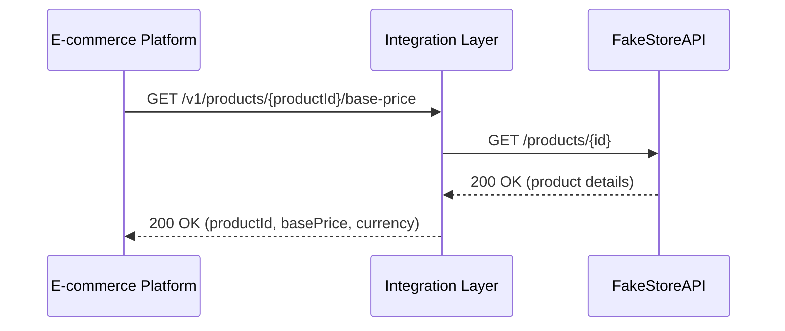

### I.001 - E-commerce Platform to FakeStoreAPI: Base Price Retrieval

---

# High-level Requirements

## High-level diagram



|  | **Input** |
| --- | --- |
| **Interface name** | I.001 - E-commerce Platform to FakeStoreAPI: Base Price Retrieval |
| **Interface description** | Retrieve the base price of a product in USD from the master catalog. The Integration Layer receives the product ID, queries the catalog, and formats the response. |
| **Data object** | Product Base Price |

## Sender

|  | **Input** |
| --- | --- |
| **Sender system name** | E-commerce Platform |
| **Sender protocol** | HTTPs |
| **Message format** | JSON |
| **Technical objects / API name** |  |
| **Rationale** | Standard REST API for frontend client integration |

## Receiver

|  | **Input** |
| --- | --- |
| **Receiver system name** | FakeStoreAPI |
| **Receiver protocol** | HTTPs |
| **Message format** | JSON |
| **Technical objects / API name** |  |
| **Rationale** | Public product catalog acting as the System of Record |

## Integration characteristics

|  | **Input** |
| --- | --- |
| **Interaction type** | Sync |
| **Pull or Push** | Pull |
| **Frequency** | Event-based |
| **Volumetry** |  |
| **Max message size** |  |
| **Average messages per day** |  |
| **Max messages per day** |  |
| **Security specifications** | HTTPS with standard API gateway authentication |
| **Message transformation** | Yes - Transformation from catalog format to internal standard format |

# Detailed Requirements

## Mapping and Data Model

### Sender Data Model

```yaml
openapi: 3.0.0
info:
  title: Base Price Service
  version: 1.0.0
paths:
  /v1/products/{productId}/base-price:
    get:
      summary: Retrieve the base price of a product in USD
      parameters:
        - name: productId
          in: path
          required: true
          schema:
            type: integer
            example: 1
      responses:
        '200':
          description: Base price retrieved successfully
          content:
            application/json:
              schema:
                type: object
                properties:
                  productId:
                    type: integer
                    example: 1
                  basePrice:
                    type: number
                    format: float
                    example: 109.95
                  currency:
                    type: string
                    example: "USD"

```

### Sender Message Example

#### Request (cURL)

`curl -X GET "https://api.internal-domain.com/v1/products/1/base-price"`

#### Response (cURL)

`HTTP/1.1 200 OK Content-Type: application/json { "productId": 1, "basePrice": 109.95, "currency": "USD" }`

### Receiver Data Model

```yaml
openapi: 3.0.0
info:
  title: FakeStoreAPI Catalog
  version: 1.0.0
paths:
  /products/{id}:
    get:
      summary: Get a single product
      parameters:
        - name: id
          in: path
          required: true
          schema:
            type: integer
            example: 1
      responses:
        '200':
          description: Product details
          content:
            application/json:
              schema:
                type: object
                properties:
                  id:
                    type: integer
                    example: 1
                  title:
                    type: string
                    example: "Fjallraven - Foldsack No. 1 Backpack, Fits 15 Laptops"
                  price:
                    type: number
                    format: float
                    example: 109.95
                  description:
                    type: string
                    example: "Your perfect pack for everyday use and walks in the forest."
                  category:
                    type: string
                    example: "men's clothing"
                  image:
                    type: string
                    format: uri
                    example: "https://fakestoreapi.com/img/81fPKd-2AYL._AC_SL1500_.jpg"
                  rating:
                    type: object
                    properties:
                      rate:
                        type: number
                        format: float
                        example: 3.9
                      count:
                        type: integer
                        example: 120

```

### Receiver Message Example

Request:

`fakestore_product_request`

`curl -X GET "https://fakestoreapi.com/products/1"`

Response:

`fakestore_product_response`

`HTTP/1.1 200 OK Content-Type: application/json { "id": 1, "title": "Fjallraven - Foldsack No. 1 Backpack, Fits 15 Laptops", "price": 109.95, "description": "Your perfect pack...", "category": "men's clothing", "image": "https://fakestoreapi.com/img/81fPKd-2AYL._AC_SL1500_.jpg", "rating": { "rate": 3.9, "count": 120 } }`

### Message Mapping

#### Request

##### Sender to Receiver

| **Source path** | **Mapping rule** | **Target path** | **Example** | **Required** | **Comment** |
| --- | --- | --- | --- | --- | --- |
| `URI parameter: productId` | Pass Through | `URI parameter: id` | `1` | Yes | Numeric product identifier |

#### Response

##### Receiver to Sender

| **Source path** | **Mapping rule** | **Target path** | **Example** | **Required** | **Comment** |
| --- | --- | --- | --- | --- | --- |
| `$.id` | Pass Through | `$.productId` | `1` | Yes |  |
| `$.price` | Pass Through | `$.basePrice` | `109.95` | Yes | Numeric price value |
| N/A | Hardcoded | `$.currency` | `'USD'` | N/A | FakeStoreAPI defaults to USD |

### Model Validation

#### Sender Model Validation

* `productId`: Required, must be a positive integer.
