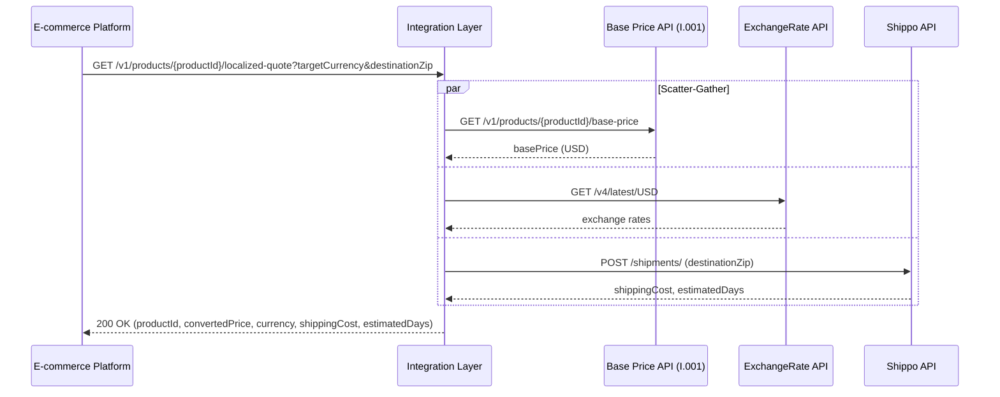

### I.002 - E-commerce Platform to Logistics API: Localized Quote

---

# High-level Requirements

## High-level diagram



|  | **Input** |
| --- | --- |
| **Interface name** | I.002 - E-commerce Platform to Logistics API: Localized Quote |
| **Interface description** | Generate a complete quote including currency conversion and shipping. The Integration Layer calls the Base Price API (I.001), converts the currency via ExchangeRate API, fetches shipping costs via Shippo, and aggregates the data. |
| **Data object** | Localized Order Quote |

## Sender

|  | **Input** |
| --- | --- |
| **Sender system name** | E-commerce Platform |
| **Sender protocol** | HTTPs |
| **Message format** | JSON |
| **Technical objects / API name** |  |
| **Rationale** | Standard REST API for frontend client checkout process |

## Receiver

|  | **Input** |
| --- | --- |
| **Receiver system name** | Logistics Composite API (calling Base Price, ExchangeRate, Shippo) |
| **Receiver protocol** | HTTPs |
| **Message format** | JSON |
| **Technical objects / API name** |  |
| **Rationale** | Process API orchestrating multiple downstream systems |

## Integration characteristics

|  | **Input** |
| --- | --- |
| **Interaction type** | Sync |
| **Pull or Push** | Pull |
| **Frequency** | Event-based |
| **Volumetry** |  |
| **Max message size** |  |
| **Average messages per day** |  |
| **Max messages per day** |  |
| **Security specifications** | HTTPS with standard API gateway authentication |
| **Message transformation** | Yes - Aggregation and transformation from three downstream systems into one cohesive response |

# Detailed Requirements

## Mapping and Data Model

### Sender Data Model

```yaml
openapi: 3.0.0
info:
  title: Localized Quote Service
  version: 1.0.0
paths:
  /v1/products/{productId}/localized-quote:
    get:
      summary: Get a complete quote including currency conversion and shipping
      parameters:
        - name: productId
          in: path
          required: true
          schema:
            type: integer
            example: 1
        - name: targetCurrency
          in: query
          required: true
          schema:
            type: string
            example: "EUR"
        - name: destinationZip
          in: query
          required: true
          schema:
            type: string
            example: "21000"
      responses:
        '200':
          description: Localized quote generated successfully
          content:
            application/json:
              schema:
                type: object
                properties:
                  productId:
                    type: integer
                    example: 1
                  convertedPrice:
                    type: number
                    format: float
                    example: 104.45
                  currency:
                    type: string
                    example: "EUR"
                  shippingCost:
                    type: number
                    format: float
                    example: 15.00
                  estimatedDays:
                    type: integer
                    example: 3

```

### Sender Message Example

#### Request (cURL)

`curl -X GET "https://api.internal-domain.com/v1/products/1/localized-quote?targetCurrency=EUR&destinationZip=21000"`

#### Response (cURL)

`HTTP/1.1 200 OK Content-Type: application/json { "productId": 1, "convertedPrice": 104.45, "currency": "EUR", "shippingCost": 15.00, "estimatedDays": 3 }`

### Receiver Data Model

*(Note: This block represents the three distinct downstream systems orchestrated by this interface.)*

```yaml
openapi: 3.0.0
info:
  title: Downstream Systems (Base Price, ExchangeRate, Shippo)
  version: 1.0.0
paths:
  # Downstream 1: Base Price API
  /v1/products/{productId}/base-price:
    get:
      summary: Retrieve the base price of a product in USD
      parameters:
        - name: productId
          in: path
          required: true
          schema:
            type: integer
      responses:
        '200':
          description: Base price retrieved
          content:
            application/json:
              schema:
                type: object
                properties:
                  productId: { type: integer }
                  basePrice: { type: number, format: float }
                  currency: { type: string }

  # Downstream 2: ExchangeRate API
  /v4/latest/{base_currency}:
    get:
      summary: Get exchange rates for a base currency
      parameters:
        - name: base_currency
          in: path
          required: true
          schema:
            type: string
            example: "USD"
      responses:
        '200':
          description: Exchange rates retrieved
          content:
            application/json:
              schema:
                type: object
                properties:
                  base: { type: string }
                  rates:
                    type: object
                    additionalProperties: { type: number, format: float }

  # Downstream 3: Shippo API
  /shipments/:
    post:
      summary: Get shipping rates
      requestBody:
        required: true
        content:
          application/json:
            schema:
              type: object
              properties:
                address_to:
                  type: object
                  properties:
                    zip: { type: string }
      responses:
        '200':
          description: Shipping rates retrieved
          content:
            application/json:
              schema:
                type: object
                properties:
                  amount: { type: string, example: "15.00" }
                  estimated_days: { type: integer, example: 3 }

```

### Receiver Message Example

*(Downstream 1: Base Price API)*
`curl -X GET "https://api.internal-domain.com/v1/products/1/base-price"`
*(Returns: `basePrice`: 109.95, `currency`: "USD")*

*(Downstream 2: ExchangeRate API)*
`curl -X GET "https://api.exchangerate-api.com/v4/latest/USD"`
*(Returns: EUR conversion rate, e.g., 0.95)*

*(Downstream 3: Shippo API)*
`curl -X POST "https://api.goshippo.com/shipments/" -d '{"address_to": {"zip": "21000"}, ...}'`
*(Returns: `amount`: "15.00", `estimated_days`: 3)*

### Message Mapping

#### Request

##### Sender to Receivers (Aggregation)

| **Source path** | **Mapping rule** | **Target path** | **Example** | **Required** | **Comment** |
| --- | --- | --- | --- | --- | --- |
| `URI param: productId` | Pass Through | `Base Price API -> URI: productId` | `1` | Yes |  |
| `Hardcoded 'USD'` | Pass Through | `ExchangeRate API -> URI: base_currency` | `'USD'` | Yes |  |
| `Query param: destinationZip` | Pass Through | `Shippo API -> $.address_to.zip` | `'21000'` | Yes |  |

#### Response

##### Receivers to Sender (Aggregation)

| **Source path** | **Mapping rule** | **Target path** | **Example** | **Required** | **Comment** |
| --- | --- | --- | --- | --- | --- |
| `Base Price API -> $.productId` | Pass Through | `$.productId` | `1` | Yes |  |
| `Base Price API -> $.basePrice` | Multiply by Rate | `$.convertedPrice` | `104.45` | Yes | Math: `basePrice` * `rates[targetCurrency]`. Format to 2 decimals. |
| `Sender -> Query param: targetCurrency` | Pass Through | `$.currency` | `'EUR'` | Yes |  |
| `Shippo API -> $.amount` | Parse Float | `$.shippingCost` | `15.00` | Yes | Convert string to number, format to 2 decimals. |
| `Shippo API -> $.estimated_days` | Pass Through | `$.estimatedDays` | `3` | Yes | Integer |

### Model Validation

#### Sender Model Validation

* `productId`: Required, integer.
* `targetCurrency`: Required, exactly 3 uppercase letters (ISO 4217).
* `destinationZip`: Required, string format.

## Error and Exceptional Case Processing

*(Applies to both interfaces)*

### Experience API

#### Data Errors

| **S. No.** | **Scenario** | **Standard error description** | **Error codes** |
| --- | --- | --- | --- |
| 1 | Request is not valid according to schema | 'Bad Request' | `400` |
| 2 | Missing required path or query parameters | 'Bad Request' | `400` |
| 3 | Invalid target currency format | 'Bad Request' | `400` |

#### Technical Errors

| **S. No** | **Scenario** | **Standard error response** | **Error codes** |
| --- | --- | --- | --- |
| 1 | Any error on downstream interface (System APIs) | Keep error details including code and description | Based on System API response |
| 2 | In case of any unaccepted errors (exception) occurred | 'Internal Server Error' | `500` |
| 3 | Logistics service unavailable | 'Service Unavailable' | `503` |
| 4 | Timeout waiting for downstream response | 'Gateway Timeout' | `504` |

### System API

#### Data Errors

| **S. No.** | **Scenario** | **System Error Code** | **Description** |
| --- | --- | --- | --- |
| 1 | FakeStore returns 404 (Product Not Found) | `404` | 'Not Found' - Product does not exist |
| 2 | ExchangeRate returns unsupported currency | `422` | 'Unprocessable Entity' - Currency conversion failed |
| 3 | Shippo returns invalid zip code | `422` | 'Unprocessable Entity' - Shipping calculation failed |

#### Connectivity Errors

| **S. No.** | **Scenario** | **System Error Code** |
| --- | --- | --- |
| 1 | In case of connectivity error, no retry should be performed, exception raised. | `503` |
| 2 | In case of timeout occurred | `504` |
